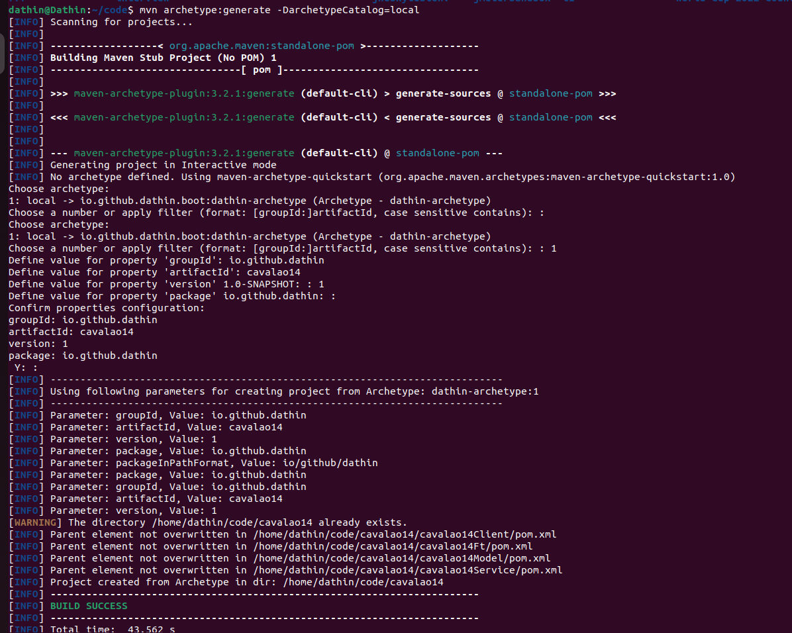

### How to use
```bash
mvn clean install
```
```bash
mvn archetype:generate -DarchetypeCatalog=local
```

Input example:

- Define value for property 'groupId': io.github.dathin
- Define value for property 'artifactId': cavalao
- Define value for property 'version' 1.0-SNAPSHOT: : 1
- Define value for property 'package' io.github.dathin: :

(The package really should be an empty value)

Do not forget to search for code TODO and to mvn clean install before using. IDE may get a little confused.